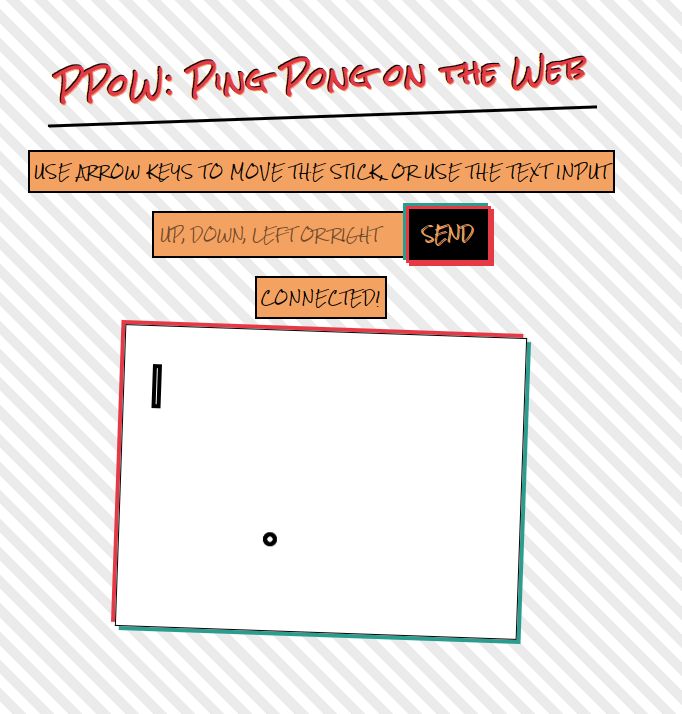

# Ping pong on the Web



- We want to have a ping pong game on the web
- Backend in OCaml -> [Dream](https://aantron.github.io/dream/)
- Frontend: HTML5 Canvas + [js_of_ocaml](https://ocsigen.org/js_of_ocaml/latest/manual/overview)
  - Here are [some examples](https://github.com/ocsigen/js_of_ocaml/blob/master/examples)
- Communication: [WebSocket](https://developer.mozilla.org/en-US/docs/Web/API/WebSocket)
- The frontend listens for keyboard/mouse events, sends actions to the backend
- It receives game state updates from the backend and renders them.
- For the websocket message we will use S-expression. As backend and frontend are written
in OCaml it looks an easy way to serialize OCaml values.

# Architecture

- Backend in OCaml using Dream for WebSockets.
- Frontend in OCaml using js_of_ocaml to render the game.
- WebSockets for real-time communication between client and server.

# Steps

- [x] start playing with Dream
- [x] start playing with js_of_ocaml
- [x] simple rendering (a ball)
- [x] understand websockets
- [x] simple communication between backend/frontend to move the ball
- [x] move the ball alone
- [x] move one stick
- [x] add interaction between stick and ball
- [ ] add another stick
- [ ] implement ping pong

# Changelog

- `2025-03-08`:
    - Detect hits with boundaries and stick

- `2025-03-05`:
    - Use another CSS and group input and button in a div
    - Fix an issue when hitting walls with the ball
    - Add the first stick
    - Move the stick by sending message
    - Move the stick using arrow keys
      - TODO: it moves but we need to manage boundaries and collision

- `2025-03-03`:
    - Remove `websocket_client` because frontend is working now
    - Create `lib/game_types.ml` that describes
      - the state of the game
      - the client message
        - init to get the canvas size and the ball position
        - move to direction
      - the server message
        - ack to init
        - ack to move
      - Init of canvas is done
      - Messages are exchanged
      - Ball is moving... next is interaction
```sh
❯ dune build && ./_build/default/backend/server.exe
03.03.25 19:46:48.853                       Running at http://localhost:8080
03.03.25 19:46:48.853                       Type Ctrl+C to stop
03.03.25 19:46:52.173    dream.logger  INFO REQ 1 GET /ws ::1:39938 fd 6 Mozilla/5.0 (X11; Linux x86_64; rv:128.0) Gecko/20100101 Firefox/128.0
03.03.25 19:46:52.173                       REQ 1 Client connected!
03.03.25 19:46:52.173    dream.logger  INFO REQ 1 101 in 79 μs
03.03.25 19:46:52.185                       REQ 1 Received: Init
03.03.25 19:46:57.243                       REQ 1 Received: (Move Up)
03.03.25 19:47:01.971                       REQ 1 Received: (Move Left)
```
- `2025-03-02`:
    - Can now test that a message can be exchange between client/server:
      - start the server: `./_build/default/backend/server.exe`
      - load the client into browser, click **Send Message**
```sh
❯ ./_build/default/backend/server.exe
02.03.25 14:58:31.674                       Running at http://localhost:8080
02.03.25 14:58:31.674                       Type Ctrl+C to stop
02.03.25 14:58:37.078    dream.logger  INFO REQ 1 GET /ws ::1:53826 fd 6 Mozilla/5.0 (X11; Linux x86_64; rv:128.0) Gecko/20100101 Firefox/128.0
02.03.25 14:58:37.078                       REQ 1 Client connected!
02.03.25 14:58:37.078    dream.logger  INFO REQ 1 101 in 106 μs
02.03.25 14:58:39.897                       REQ 1 Received: Hello from client!
02.03.25 14:58:43.135                       REQ 1 Received: Hello from client!
```

- `2025-03-01`:
    - Create a simple client to test the server: `wbesocket_client/client.html`
    - Server.ml accept websocket
      - build with `dune build`
      - run: `./_build/default/backend/server.exe`
    - Modifying hello.ml into server.ml
    - [Dream](https://aantron.github.io/dream/)
      - [hello](https://aantron.github.io/dream/)
    - `dune build && ./_build/default/backend/hello.exe`
